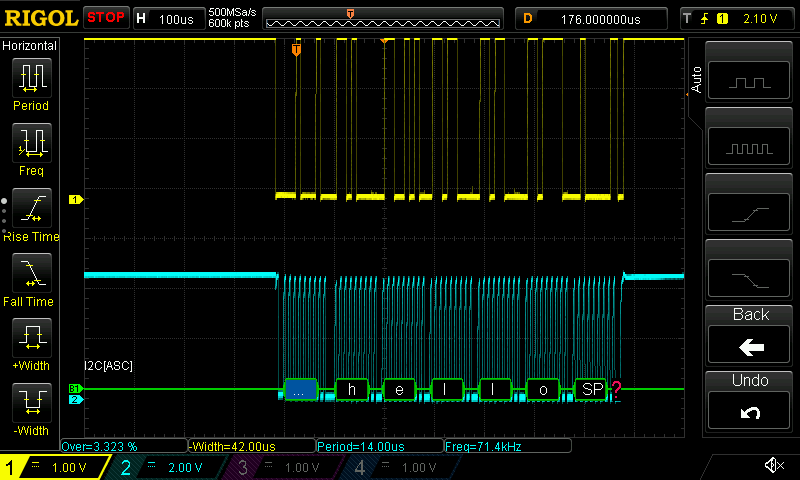
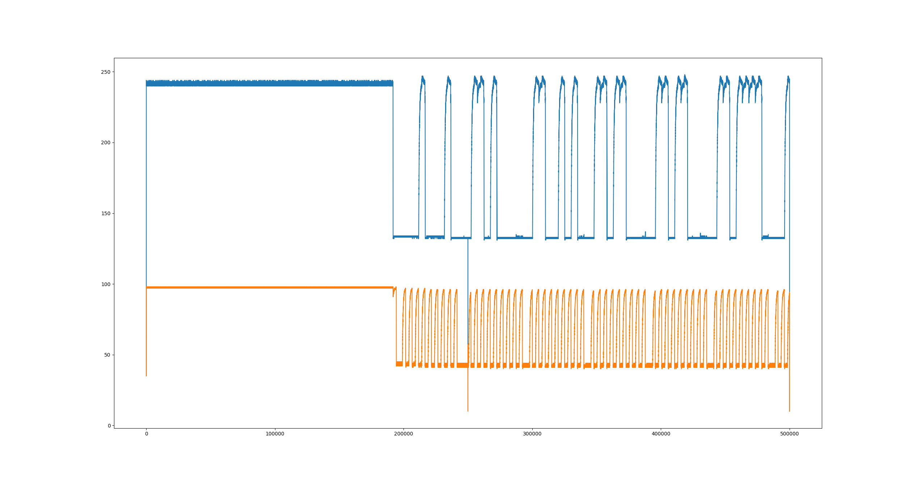

# Rigol DS1000Z

Interact with your DS1000Z range scope using Python and Telnet

Currently gets the raw display bytes from the scope screen and plots them with matplotlib

## Example

### Scope image



This can be grabbed with the following command[^1]

[^1]: Source: <https://www.theimpossiblecode.com/blog/rigol-ds1054z-screen-capture-linux/>

```bash
export RIGOL_IP=""
echo ':display:data?' | netcat -w 1 "$RIGOL_IP" 5555 | tail -c+12 > scope.bmp`
```

The `-w` flag sets a timeout in seconds, so increase if 1s is not enough for your setup

### Matplotlib output

Output of running `python3 main.py` as it stands



## Requirements

- Python 3
- matplotlib
- A Rigol DS1000Z series scope, connected to your LAN

## Links

- [Rigol Programming Guide](https://www.rigol-uk.co.uk/jg/wp-content/uploads/2021/05/Rigol-DS1000Z-ProgrammingGuide.pdf)